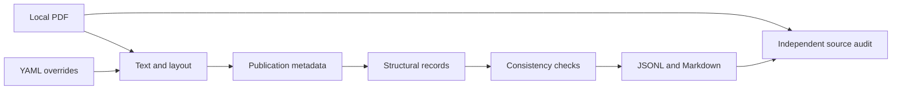

# IAEA Guidance Parser

A Python demonstration of turning a publication PDF into records that can be searched, inspected, and traced back to their source.

The project works with local copies of the **IAEA Safety Standards Series** and **Nuclear Security Series**. It identifies paragraphs, requirements, headings, tables, figure captions, footnotes, and references. Each record keeps its publication, section, and physical PDF page. JSONL supports analysis; Markdown supports reading and retrieval tools, including Custom GPTs.

The interesting problem is preserving meaning across layouts: a number may identify a paragraph, a table cell, or a page footer. A table or footnote may interrupt a paragraph that continues on the next page. This repository shows how explicit rules and PDF geometry handle those cases, and how independent source checks expose mistakes.

**It is an unofficial parser.** It does not download publications or establish the authority of their contents. Tables without recoverable geometry remain raw text; figures retain captions and source locations. Consult the PDF when wording or visual relationships matter.

## Try a small example

Python 3.10 or newer is required. From the repository root:

```bash
python3 -m venv .venv
source .venv/bin/activate
python -m pip install -e ".[dev]"
python examples/create_demo.py --out tmp/demo.pdf
iaea-guidance-parser parse tmp/demo.pdf --out tmp/demo-output
```

On Windows, activate with `.venv\Scripts\activate` instead. The generated two-page PDF is visibly marked **synthetic demonstration content**, and is not an IAEA publication.

Open `tmp/demo.pdf` next to `tmp/demo-output/custom_gpt_knowledge.md`. The example contains ordinary paragraphs and a small checklist. The checklist includes a cell beginning `2.1.`: its position inside a table keeps it from becoming a new publication paragraph.

A paragraph becomes a record with fields like these:

```json
{
  "element_type": "paragraph",
  "element_id": "2.1",
  "source_region": "Body",
  "text_status": "Normative",
  "section_path": ["2. WORKED EXAMPLE"],
  "page_start_pdf": 1,
  "page_end_pdf": 1,
  "text": "A record keeps its source label and physical PDF page."
}
```

This abbreviated example omits the generated identifier and publication metadata. Inspect `structural_index.jsonl` for complete records. For the table, `extra.table` contains cell text, row/column positions, merged-cell spans, and bounding boxes; its original extracted text is also retained.

## Follow the pipeline



1. **Extract:** read text, typography, and geometry. Identify margin page numbers, figure interiors, and captioned table bounds.
2. **Identify:** infer the publication's title, series, category, and identifier; apply any configured overrides.
3. **Parse:** walk lines in order, tracking the current section and separate buffers for prose, tables, and footnotes.
4. **Check and export:** flag inconsistent records and write readable and machine-readable representations from the same records.
5. **Audit:** compare independent Poppler text and the PDF's bookmark outline, reconcile exports, and record the evidence and remaining source-review work.

The parser uses deterministic Python rules. It does not call an LLM or require an API key.

The rules now handle several patterns that previously needed handwritten
document overrides. A raised footnote marker links a note to the paragraph
containing that marker, even when other paragraphs appear before the footer.
A bold glossary opening starts a definition; the same term in italic prose
does not. Aligned, closely spaced bold heading lines can form one heading.
Within a section, a clear size or italic-style distinction can establish a
subheading's parent. Figures retain their own labels and notes, and detected
table grids preserve shaded cells, including blank ones.

These rules preserve PDF typography internally rather than rewriting scientific
symbols. Plain text can still flatten positional superscripts and subscripts;
the source PDF remains necessary for interpreting ambiguous notation. An
uncertain footnote or layout association becomes an audit finding.

Integration removed **239 override entries** across thirteen publications while
preserving their verified substantive records. Damaged fonts, ambiguous layouts
and artwork transcriptions still need source-bound configuration. The
local integration report (`reviews/parser-integration-results.md`) distinguishes
these staged results from completed source reviews.

Image-only text needs an explicit, reviewed transcription before it can be
included. Such records identify their origin, and the reading exports display
a source note. They retain a reference to the whole source page.

A source-backed example is the rotated categorization table in NSS-13. Its
printed lines do not separate every uranium enrichment subrow. The
[document override](configs/document_overrides/Security/NSS-13.yaml) records
the reviewed cell boundaries and merged labels; cell text still comes directly
from the PDF. The local validation record (`docs/validation.md`, NSS-13 checkpoint)
explains how the table and its source references were checked.

NSS-35-G shows why text alone is insufficient: it labels 118 actions beneath
stages and responsible parties. Its
[override](configs/document_overrides/Security/NSS-35-G.yaml) preserves each
action as a separate paragraph, with a path such as
`Stage 8 → Decommissioning stage actions → Operator actions` and its source page.

## Run your own publications

Keep PDFs in local folders; the source corpus and generated outputs are excluded from Git.

```bash
iaea-guidance-parser series inputs/Security \
  --series-config configs/nuclear_security_series.yaml \
  --config-dir configs/document_overrides/Security \
  --out outputs/Security

iaea-guidance-parser series inputs/Safety \
  --series-config configs/nuclear_safety_series.yaml \
  --config-dir configs/document_overrides/Safety \
  --out outputs/Safety
```

Substitute your own input paths. For a trial run, add `--limit 1` and choose a separate output directory. `parse` handles one PDF; `batch` retains the original per-filename folder layout; `series` also produces combined outputs. See `iaea-guidance-parser COMMAND --help` for options.

The supplied overrides identify their source PDF by SHA-256, the same hash recorded in publication metadata. PDF and YAML filenames can change without losing the match. See [Configuration](docs/configuration.md) for the `match.source_sha256` field and how to add an override.

A successful complete recursive series run removes obsolete generated document folders. Limited, patterned, nonrecursive, or failed runs preserve them. A failed series run returns a nonzero exit status and records failures in the manifest.

## Read the outputs

| Output | What it contains |
| --- | --- |
| `series_structural_index.jsonl` | Canonical records, including source evidence and table geometry. |
| `series_custom_gpt_knowledge_parts/part_*.md` | Numbered Markdown parts for reading or uploading together. |
| `series_custom_gpt_knowledge.md` | The full Markdown collection for local use. |
| `series_custom_gpt_knowledge.jsonl` | Records adapted for retrieval, with formatted chunk text. |
| `series_manifest.json` / `.csv` | Documents, counts, source hashes, configuration fingerprints, and failures. |
| `qa_report.json` / `.md` | Automated consistency findings; not proof of source accuracy. |
| `documents/<document_id>/` | Metadata and outputs for an individual publication. |

`series_qa_report.md` retains the series summary. File counts and inventory come from the current manifest; the former static `filelist.txt` has been removed because it no longer represented the corpus.

Physical PDF pages are **one-based positions in the file**. Printed page numbers are separate and may be absent or offset by front matter. A record's `element_id` preserves the publication label; `record_id` distinguishes records when labels repeat. Record IDs may change after a correction alters segmentation.

Status labels describe the parser's structural interpretation:

| Label | Implemented interpretation |
| --- | --- |
| `Normative` | Technical body content from Section 2 onward and integral appendix content. |
| `Informative` | Annex content and footnotes. |
| `Informational` | Introductory material, headings, references, glossary, and publication front/back matter. |

These labels do **not** establish legal obligations or turn a recommendation into a requirement. Preserve the source's wording and publication category when interpreting a record.

For upload instructions and a suggested system prompt, see [Using the knowledge files](docs/custom-gpt.md). For overrides and their precedence, see [Configuration](docs/configuration.md).

## Check accuracy against the source

Source auditing additionally requires Poppler (`pdftotext`; `pdftoppm` for visual review). Install it through your operating system's package manager, then run:

```bash
iaea-guidance-parser audit inputs/Security \
  --parsed outputs/Security --out tmp/audit/Security
```

The audit writes a summary, evidence-bearing findings, a CSV covering every physical page, and a document-check ledger. It checks canonical records against document outputs and Markdown, compares source text independently, and identifies required source reviews. It never repairs or rewrites the parsed outputs.

A token difference is a review candidate. PDF engines can disagree; line wrapping, source font encodings, hidden objects, diagrams, and intentional exclusions need inspection. Heading-only pages can pass a strict comparison of wording, location, order and hierarchy against the source bookmark tree. Missing or ambiguous outline evidence leaves a page pending.

NSS-10-G (Rev. 1) illustrates the limit of text matching: two subsection
headings retained every word but were absorbed into preceding paragraphs.
Visual review found the error. Its [source-bound override](configs/document_overrides/Security/NSS-10-G-REV1.yaml)
now separates those headings and places the following paragraphs beneath them.

NSS-24-G demonstrates why layout matters too: a figure note can retain every
word while being attached to the wrong paragraph. Its reviewed figure bounds
keep labels and notes with their captions. Its rating tables also retain cell
shading: a blank shaded cell carries information that plain text would lose.
Reading exports mark shaded cells explicitly; the marker is not source text.

Pages containing footnotes also require their links to be checked visually;
an outline cannot establish which paragraph a note belongs to. The source
screen also flags note labels when the parser has absorbed a note into prose.
Glossary and definition pages require visual checks of each term and its
definition; a matching heading does not prove those relationships. Detailed
copyright text is outside the current review scope, while publication
identifiers remain required. Any other exclusion is recorded with its evidence
and scope so that a pass does not imply every printed word was verified.

Review records distinguish **visual inspection**, **automated structural verification**, and **verified equivalent evidence**. An inspected page can still be blocked by a defect. The small `tools/source_review.py` utility prepares bounded assignments with cached source images, validates returned decisions, and rejects stale evidence before merging it.

**Complete source verification remains unfinished.** The pilot found both parser defects and mistaken review decisions; sampling caught errors that token checks missed. See [Source audit and review](docs/auditing.md) for the reproducible procedure and [Recorded source reviews](reviews/README.md) for the locations of local coverage reports, corrections and remaining work. Run artifacts are ignored by Git and are not included in a fresh checkout.

Each completed publication gets an atomic checkpoint containing its corrected
records, source evidence and review decisions. These staged results are kept
separate from the combined corpus until regeneration and a fresh audit confirm
that the records still match their reviews.

## Read or extend the code

Start with `models.py`, then follow `IAEAGuidanceParser.parse()` in `parser.py`. Its named stages show the ordering that keeps table cells, captions, headings, and paragraphs distinct.

Paragraphs that continue across pages remain one record. Footer notes follow
the prose that starts above them, with a separate field identifying the note's
actual anchor. This preserves reading order without splitting a paragraph at
the page break.

Specimen regulations and agreements keep their own headings and numbering.
For example, an article in a sample regulation remains within that specimen,
with its introductory guidance and source page available alongside it.

| Module | Responsibility |
| --- | --- |
| `pdf_extract.py` | PDF text, font decoding, typography, and layout geometry. |
| `metadata.py` | Publication identification and configuration merging. |
| `rules.py` | Label grammar, text normalization, and structural status policy. |
| `parser.py` | Stateful record assembly and continued elements. |
| `series.py` / `cli.py` | File discovery, configuration selection, and commands. |
| `exporters.py` | Canonical and reader-facing outputs. |
| `qa.py` / `audit.py` | Record consistency and independent source comparison. |
| `outline.py` | Strict heading checks against source bookmarks and geometry. |
| `reviews.py` | Review fingerprints, finding dispositions and evidence validation. |
| `provenance.py` | File, configuration, and code fingerprints. |

`tools/source_review.py` is a standalone preparation/merge helper. It launches no agents and makes no parser corrections; review judgment stays outside the deterministic parser.

Tests are grouped by behavior and use small synthetic inputs. A useful contribution starts with a source-backed failing example, changes the smallest relevant rule, and checks both series for unintended effects.

```bash
python -m pytest -q
ruff check .
ruff format --check .
```

Version 0.4 replaces the old Security-only audit and its separate `.clean` outputs with the `audit` command. Existing primary output fields and filenames remain; source spans and structured tables are additive. Corrections now belong in the parser or documented overrides, followed by regeneration.
